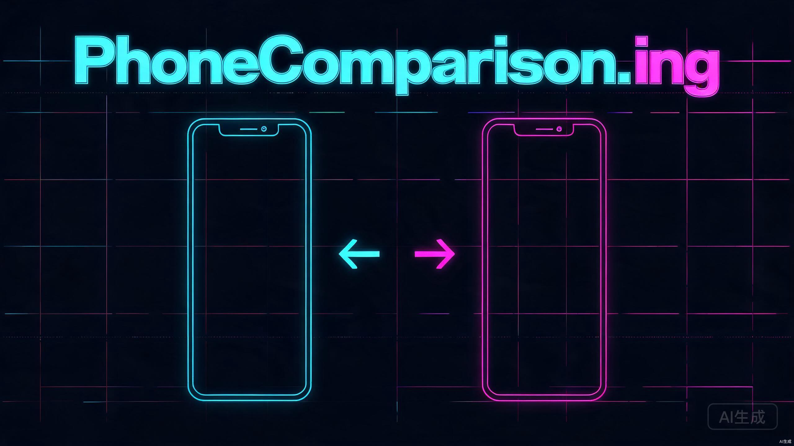

<div align="center">



# PhoneComparison<span style="color:#ff00ff">.ing</span>

**AI-Powered Phone Comparison Platform · 赛博朋克风格手机参数横向对比平台**

[](https://github.com/geoin520/PhoneComparison/stargazers)
[](https://vercel.com)
[](https://nextjs.org/)
[](https://www.typescriptlang.org/)
[](https://tailwindcss.com/)
[](https://next-intl.dev/)
[](LICENSE)

[English](#english) · [中文](#中文)

</div>

---

## 中文

### 项目简介

> 用 AI 的方式，重新定义手机对比

**PhoneComparison.ing** 是一款赛博朋克风格的手机参数横向对比平台。用户通过 5 个筛选维度（内存、存储容量、品牌、上市时间、价格区间）快速定位目标机型，一键生成带实时价格来源的横向对比矩阵。

### 特性

- **5 维度智能筛选** — 内存 / 存储容量 / 品牌 / 上市时间 / 价格区间，未选维度自动视为"全选"
- **横向对比矩阵** — 手机型号为列、参数为行，一目了然
- **实时价格追踪** — 价格来源标注（淘宝 / 京东 / 品牌官网），更新日期 ≤ 7 天显示绿色校验标记
- **中英双语切换** — 基于 next-intl，价格随语言自动切换 ¥/$
- **赛博朋克 UI** — 霓虹发光、毛玻璃导航、径向渐变光晕、扫描线动画
- **28+ 款主流机型** — 覆盖 Apple、Samsung、Xiaomi、Huawei、OnePlus、Google、OPPO、VIVO
- **Vercel 一键部署** — GitHub 推送后自动构建上线

### 在线预览

[](https://vercel.com/new/clone?repository-url=https://github.com/geoin520/PhoneComparison)

### 技术栈

| 技术 | 用途 |
|------|------|
| [Next.js 14](https://nextjs.org/) | React 框架 (App Router) |
| [TypeScript](https://www.typescriptlang.org/) | 类型安全 |
| [Tailwind CSS](https://tailwindcss.com/) | 样式系统 |
| [next-intl](https://next-intl.dev/) | 国际化 (zh / en) |
| [Space Grotesk](https://fonts.google.com/specimen/Space+Grotesk) | 标题 / 正文字体 |
| [JetBrains Mono](https://fonts.google.com/specimen/JetBrains+Mono) | 数字 / 代码字体 |

### 快速开始

```bash
# 克隆仓库
git clone https://github.com/geoin520/PhoneComparison.git
cd PhoneComparison

# 安装依赖
npm install

# 启动开发服务器
npm run dev
```

打开 [http://localhost:3000](http://localhost:3000) 查看效果。

### 项目结构

```
app/
  [locale]/                # 国际化路由组
    layout.tsx             # 根布局 (Header / Footer)
    page.tsx               # 首页（筛选区）
    compare/page.tsx       # 对比结果页
    globals.css            # 赛博朋克主题变量
  api/compare/route.ts     # 可选 API 路由
i18n/
  config.ts                # locale 配置
  navigation.ts            # 国际化路由
  request.ts               # 服务端 i18n 请求
  messages/                # zh.json / en.json
components/
  common/                  # Header / Footer / LanguageSwitcher
  home/FilterSection.tsx   # 筛选下拉菜单区
  compare/                 # ComparisonTable / CompareContent
lib/
  data/phones.ts           # 28+ 款模拟手机数据
  utils/filter.ts          # 筛选逻辑
  utils/helpers.ts         # 价格格式化 / 时效校验
types/index.ts             # TypeScript 类型定义
middleware.ts              # next-intl 中间件
```

### 配色方案

| 色值 | 用途 | 预览 |
|------|------|------|
| `#00f0ff` | 霓虹蓝 (主色调) |  |
| `#ff00ff` | 霓虹粉 (强调色) |  |
| `#8b00ff` | 霓虹紫 (辅助色) |  |
| `#0a0a0f` | 深空黑 (主背景) |  |
| `#e8e8f0` | 亮白 (正文) |  |

### 贡献

欢迎贡献！请阅读 [Contributing Guide](CONTRIBUTING.md) 了解详情。

1. Fork 本仓库
2. 创建特性分支 (`git checkout -b feature/amazing-feature`)
3. 提交变更 (`git commit -m 'feat: add amazing feature'`)
4. 推送分支 (`git push origin feature/amazing-feature`)
5. 发起 Pull Request

### License

[MIT](LICENSE) &copy; 2026 PhoneComparison.ing

---

## English

### About

> Redefining phone comparison with AI

**PhoneComparison.ing** is a cyberpunk-styled phone specs comparison platform. Users filter through 5 dimensions (RAM, Storage, Brand, Release Year, Price Range) to instantly generate a horizontal comparison matrix with real-time pricing data.

### Features

- **5-Dimension Smart Filters** — RAM / Storage / Brand / Release Year / Price Range; unselected dimensions default to "All"
- **Horizontal Comparison Matrix** — Phone models as columns, specs as rows
- **Real-Time Price Tracking** — Sources tagged (Taobao / JD.com / Official); green check for prices updated within 7 days
- **Bilingual i18n** — Powered by next-intl with automatic ¥/$ currency switching
- **Cyberpunk UI** — Neon glow effects, frosted glass navbar, radial gradient halos, scanline animations
- **28+ Phone Models** — Covering Apple, Samsung, Xiaomi, Huawei, OnePlus, Google, OPPO, VIVO
- **One-Click Vercel Deploy** — Auto-build on GitHub push

### Quick Start

```bash
# Clone the repository
git clone https://github.com/geoin520/PhoneComparison.git
cd PhoneComparison

# Install dependencies
npm install

# Start dev server
npm run dev
```

Open [http://localhost:3000](http://localhost:3000) to view the app.

### Contributing

Contributions are welcome! Please read the [Contributing Guide](CONTRIBUTING.md) for details.

1. Fork the repository
2. Create a feature branch (`git checkout -b feature/amazing-feature`)
3. Commit changes (`git commit -m 'feat: add amazing feature'`)
4. Push to branch (`git push origin feature/amazing-feature`)
5. Open a Pull Request

### License

[MIT](LICENSE) &copy; 2026 PhoneComparison.ing

<div align="center">

**Built with [Next.js](https://nextjs.org/) · Styled with [Tailwind CSS](https://tailwindcss.com/) · Powered by [Vercel](https://vercel.com/)**


</div>
